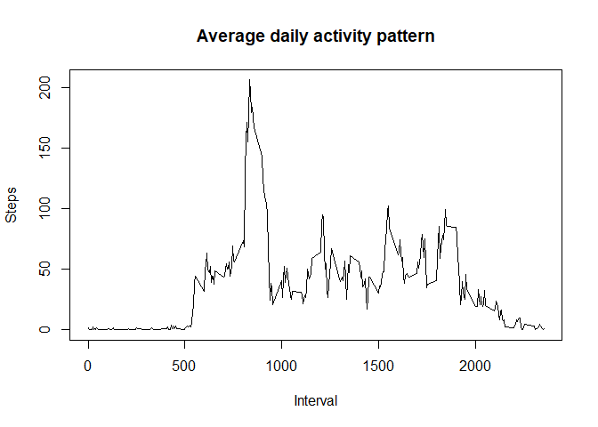
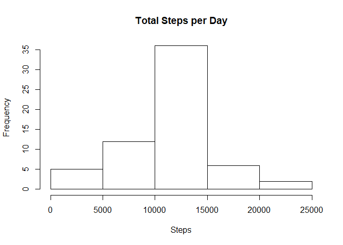
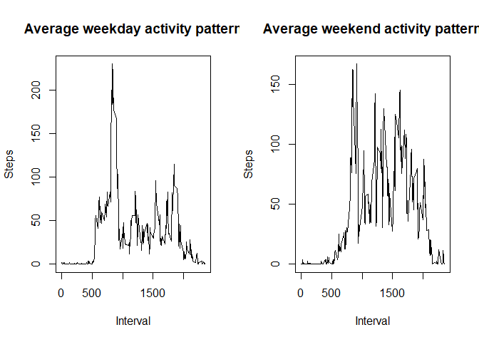

## Libraries used

```r
library(zip)
```

```
## Warning: package 'zip' was built under R version 3.6.2
```

```
## 
## Attaching package: 'zip'
```

```
## The following objects are masked from 'package:utils':
## 
##     unzip, zip
```

```r
library(ggplot2)
```

```
## Warning: package 'ggplot2' was built under R version 3.6.3
```

```r
library(dplyr)
```

```
## Warning: package 'dplyr' was built under R version 3.6.3
```

```
## 
## Attaching package: 'dplyr'
```

```
## The following objects are masked from 'package:stats':
## 
##     filter, lag
```

```
## The following objects are masked from 'package:base':
## 
##     intersect, setdiff, setequal, union
```

## Downloading the data

```r
download.file("https://d396qusza40orc.cloudfront.net/repdata%2Fdata%2Factivity.zip",destfile = "data.zip")
unzip("data.zip")
data<-read.csv("activity.csv")
```

## What is mean total number of steps taken per day?

```r
sumStep<-tapply(data$steps, data$date, sum)
```
#### Histogram of total number of steps taken each day

```r
hist(sumStep, main = "Total Steps per Day", xlab = "Steps")
```

<!-- -->

#### Mean of the steps 

```r
mean(sumStep, na.rm = TRUE)
```

```
## [1] 10766.19
```

#### Median of the steps

```r
median(sumStep,na.rm = TRUE)
```

```
## [1] 10765
```

## What is the daily average activity pattern?

#### Time series plot

```r
stepInterval<-tapply(data$steps, data$interval, mean, na.rm=TRUE)

plot(as.numeric(names(stepInterval)),stepInterval,
     ylab = "Steps", 
     type = "l", 
     xlab = "Interval",
     main = "Average daily activity pattern")
```

<!-- -->

#### Interval associated with maximum activity

```r
int<-names(stepInterval[which.max(stepInterval)])
step<-stepInterval[which.max(stepInterval)]
```
interval= 835
steps= 206.1698113

## Imputing the missing values

#### Calculating total number of missing values


```r
naval<-sum(is.na(data$steps))
print(naval)
```

```
## [1] 2304
```

#### New data set with missing values filled by mean of that interval


```r
splitdata<-split(data,data$interval)
for (i in 1:length(splitdata)){
  splitdata[[i]]$steps[is.na(splitdata[[i]]$steps)]<-stepInterval[i]
}
```

#### After filling of missing values, histogram and mean and median


```r
newData<-unsplit(splitdata,data$interval)
newSumStep<-tapply(newData$steps, newData$date, sum)
hist(newSumStep, main = "Total Steps per Day", xlab = "Steps")
```

<!-- -->

```r
m<-mean(newData$steps)
med<-median(newData$steps)
```

The new mean = 37.3825996
the new median= 0

## Are ther differences in activity patterns between weekdays na wwekends?

#### Creating two new factor variables "weekday" and weekend"

```r
newData$date<-as.POSIXct(newData$date)
newData$day<-""
newData[weekdays(newData$date)=="Saturday" | weekdays(newData$date)=="Sunday",4] <-"weekend"
newData[!(weekdays(newData$date)=="Saturday" | weekdays(newData$date)=="Sunday"),4]  <-"weekday"
```

#### Time series panel plot over weekdays and weekends

```r
weekdaymean<-with(newData[newData$day=="weekday",],tapply(steps, interval, mean, na.rm=TRUE))
weekendmean<-with(newData[newData$day=="weekend",],tapply(steps, interval, mean, na.rm=TRUE))

par(mfrow=c(1,2))

plot(as.numeric(names(weekdaymean)),weekdaymean,
     ylab = "Steps", 
     type = "l", 
     xlab = "Interval",
     main = "Average weekday activity pattern")

plot(as.numeric(names(weekendmean)),weekendmean,
     ylab = "Steps", 
     type = "l", 
     xlab = "Interval",
     main = "Average weekend activity pattern")
```

<!-- -->


